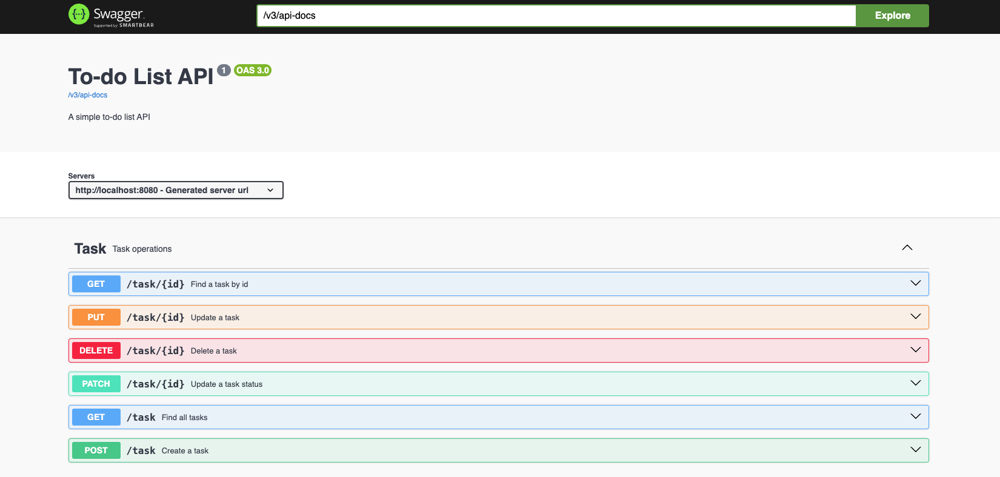

# To-do List API

## Descrição
Uma API simples de lista de tarefas construída com Spring Boot.

[](./screenshots/1.png)

## Requisitos
- Java 17
- Maven
- PostgreSQL

## Configuração do Banco de Dados
Certifique-se de que o PostgreSQL está instalado e em execução. Configure as credenciais do banco de dados no arquivo `application.properties` ou `application.yml`.

## Executando a Aplicação
Para executar a aplicação, use o seguinte comando Maven:
```shell
mvn spring-boot:run
```

## Endpoints da API

### Criar uma Tarefa
- **URL:** `/task`
- **Método:** `POST`
- **Corpo da Requisição:** JSON contendo os dados da tarefa
- **Resposta:** JSON contendo a tarefa criada

### Buscar Todas as Tarefas
- **URL:** `/task`
- **Método:** `GET`
- **Resposta:** JSON contendo a lista de todas as tarefas

### Buscar Tarefa por ID
- **URL:** `/task/{id}`
- **Método:** `GET`
- **Resposta:** JSON contendo a tarefa encontrada ou erro 404 se não encontrada

### Atualizar uma Tarefa
- **URL:** `/task/{id}`
- **Método:** `PUT`
- **Corpo da Requisição:** JSON contendo os dados atualizados da tarefa
- **Resposta:** JSON contendo a tarefa atualizada

### Atualizar Status de uma Tarefa
- **URL:** `/task/{id}`
- **Método:** `PATCH`
- **Parâmetro de Requisição:** `done` (boolean)
- **Resposta:** JSON contendo a tarefa com o status atualizado

### Deletar uma Tarefa
- **URL:** `/task/{id}`
- **Método:** `DELETE`
- **Resposta:** Mensagem de confirmação de exclusão

## Documentação da API
A documentação da API está disponível em `/docs` após iniciar a aplicação.

## Autor
- Anderson Viana